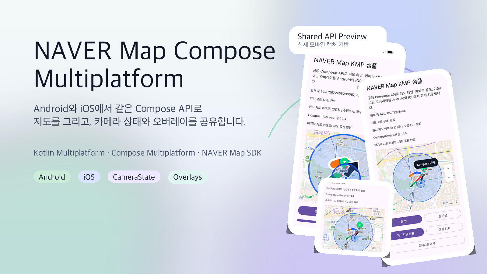
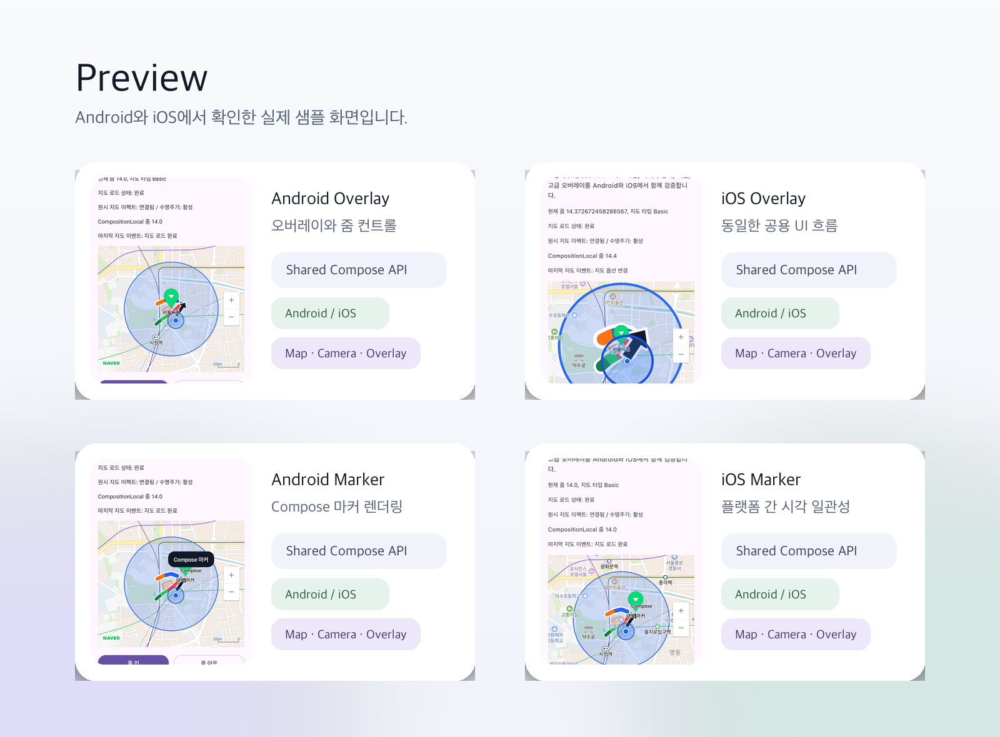

# NAVER Map Compose Multiplatform



[](https://search.maven.org/artifact/io.github.hyungju.navermap/naver-map-compose)
[](https://kotlinlang.org/)
[](https://www.jetbrains.com/compose-multiplatform/)
[](LICENSE)

이 라이브러리는 Kotlin Multiplatform과 Compose Multiplatform에서 사용할 수 있는 NAVER Map API를 제공합니다. Android와 iOS에서 공통 Compose API로 지도를 렌더링하고, 카메라 상태와 지도 옵션, `MarkerComposable`을 포함한 주요 오버레이와 이벤트를 공유하는 것을 목표로 합니다.

이 프로젝트는 [`fornewid/naver-map-compose`](https://github.com/fornewid/naver-map-compose)를 레퍼런스로 삼아 시작했습니다. 다만 Android 전용 API를 그대로 옮기기보다, 멀티플랫폼 환경에 맞는 공통 추상화를 우선하는 방향으로 설계하고 있습니다.



## Sample App

이 저장소에는 Android와 iOS에서 공용 API를 확인할 수 있는 샘플 앱이 포함되어 있습니다. 실행하려면 먼저 NAVER 지도 클라이언트 ID를 준비해야 합니다.

1. [NAVER Maps Android SDK 시작하기](https://navermaps.github.io/android-map-sdk/guide-ko/1.html)를 참고해 클라이언트 ID를 발급받습니다.
2. Android용 `local.properties`를 준비합니다.

```properties
sdk.dir=/Users/your-user/Library/Android/sdk
naver.map.client.id=YOUR_NCP_KEY_ID_HERE
```

3. iOS용 `iosApp/Config/LocalSecrets.xcconfig`를 준비합니다.

```xcconfig
NAVER_MAP_CLIENT_ID = YOUR_NCP_KEY_ID_HERE
```

4. Android 샘플을 빌드하고 실행합니다.

```bash
./gradlew :composeApp:assembleDebug
./gradlew :composeApp:installDebug
```

5. iOS 샘플을 실행합니다.

```bash
cd iosApp
pod install
open iosApp.xcworkspace
```

## Download

### `naver-map-compose`

[](https://search.maven.org/artifact/io.github.hyungju.navermap/naver-map-compose)

```kotlin
repositories {
    google()
    mavenCentral()
    maven("https://repository.map.naver.com/archive/maven")
}

dependencies {
    implementation("io.github.hyungju.navermap:naver-map-compose:0.1.0")
}
```

릴리스 버전은 루트 [`gradle.properties`](./gradle.properties)의 `VERSION_NAME`으로 관리합니다. Maven Central 배포 절차와 자동화 설정은 [`docs/publishing.md`](./docs/publishing.md)에 정리했습니다.

## Warnings

이 라이브러리는 내부적으로 NAVER Maps SDK를 사용합니다. 사용 전에 다음 내용을 확인해주세요.

1. NAVER Maps Android SDK는 `https://repository.map.naver.com/archive/maven` 저장소에서 배포됩니다. 따라서 루트 프로젝트의 저장소 설정에 NAVER Maven 저장소를 추가해야 합니다.

```kotlin
dependencyResolutionManagement {
    repositories {
        google()
        maven("https://repository.map.naver.com/archive/maven")
        mavenCentral()
    }
}
```

2. 샘플 앱과 실제 앱 모두 NAVER Cloud Platform 지도 클라이언트 ID가 필요합니다.
3. 현재 라이브러리는 공통 지도 호스트, 카메라 상태, 주요 지도 옵션, `MarkerComposable`을 포함한 대표 오버레이, 이벤트 콜백 중심으로 제공됩니다. 위치 소스 헬퍼와 일부 업스트림 패리티 항목은 계속 확장 중입니다.

## Usage

### 지도 추가하기

```kotlin
NaverMap(
    modifier = Modifier.fillMaxSize(),
)
```

### 지도 구성하기

`MapProperties`와 `MapUiSettings`를 사용해 지도 타입, 레이어, 제스처, 컨트롤을 공통 코드에서 설정할 수 있습니다.

```kotlin
var mapProperties by remember {
    mutableStateOf(
        MapProperties(
            mapType = MapType.Basic,
            isTrafficLayerGroupEnabled = true,
            isIndoorEnabled = false,
        )
    )
}

var mapUiSettings by remember {
    mutableStateOf(
        MapUiSettings(
            isCompassEnabled = true,
            isScaleBarEnabled = true,
            isZoomControlEnabled = true,
        )
    )
}

NaverMap(
    modifier = Modifier.fillMaxSize(),
    properties = mapProperties,
    uiSettings = mapUiSettings,
)
```

### 카메라 상태 제어하기

`CameraPositionState`를 통해 카메라 위치를 관찰하고 변경할 수 있습니다.

```kotlin
val cameraPositionState = rememberCameraPositionState {
    position = CameraPosition(
        target = LatLng(37.5666102, 126.9783881),
        zoom = 14.0,
    )
}

Box(Modifier.fillMaxSize()) {
    NaverMap(
        modifier = Modifier.fillMaxSize(),
        cameraPositionState = cameraPositionState,
    )

    Button(
        onClick = {
            cameraPositionState.position = cameraPositionState.position.copy(
                zoom = cameraPositionState.position.zoom + 1,
            )
        }
    ) {
        Text("Zoom In")
    }
}
```

### 오버레이와 MarkerComposable 사용하기

기본 `Marker`뿐 아니라 Compose UI를 그대로 캡처해 지도 아이콘으로 사용하는 `MarkerComposable`과 경로/도형/위치 오버레이를 함께 사용할 수 있습니다.

```kotlin
val cityHall = LatLng(37.5666102, 126.9783881)

NaverMap(
    modifier = Modifier.fillMaxSize(),
) {
    Marker(
        state = rememberUpdatedMarkerState(position = cityHall),
        captionText = "대표 마커",
        icon = OverlayImage.GreenMarker,
    )

    MarkerComposable(
        state = rememberUpdatedMarkerState(
            position = LatLng(37.5673, 126.9792),
        ),
    ) {
        Surface(
            color = Color(0xFF111827),
            contentColor = Color.White,
            shape = RoundedCornerShape(16.dp),
        ) {
            Text(
                text = "Compose 마커",
                modifier = Modifier.padding(horizontal = 14.dp, vertical = 10.dp),
            )
        }
    }

    CircleOverlay(
        center = cityHall,
        radiusMeters = 450.0,
        fillColor = Color(0x332A6CF0),
        outlineWidth = 2.dp,
        outlineColor = Color(0xFF2A6CF0),
    )
}
```

### Compose Marker(`MarkerComposable`) 작성 팁

`MarkerComposable`은 내부적으로 Compose 콘텐츠를 이미지로 캡처해 네이티브 마커 아이콘으로 렌더링합니다. 아래 가이드를 따르면 안정적으로 사용할 수 있습니다.

- 마커 콘텐츠는 **항상 크기가 0보다 크도록** 작성하세요. (`padding`, `sizeIn`, `defaultMinSize` 등으로 최소 크기 보장)
- 동적인 상태(텍스트, 색상, 뱃지 카운트 등)는 Compose 상태로 관리하면 자동으로 다시 캡처되어 아이콘에 반영됩니다.
- `MarkerComposable` 내부 UI는 스냅샷 이미지이므로, 버튼 클릭 같은 **직접 상호작용 UI 용도**보다는 상태 표현 중심 UI에 적합합니다.

```kotlin
val storePosition = LatLng(37.5657, 126.9770)
var isOpen by remember { mutableStateOf(true) }

NaverMap(
    modifier = Modifier.fillMaxSize(),
) {
    MarkerComposable(
        state = rememberUpdatedMarkerState(position = storePosition),
    ) {
        Surface(
            color = if (isOpen) Color(0xFF16A34A) else Color(0xFF6B7280),
            contentColor = Color.White,
            shape = RoundedCornerShape(999.dp),
            modifier = Modifier.defaultMinSize(minWidth = 72.dp),
        ) {
            Text(
                text = if (isOpen) "영업중" else "마감",
                modifier = Modifier.padding(horizontal = 12.dp, vertical = 8.dp),
            )
        }
    }
}
```

### 지도 이벤트 처리하기

클릭, 롱클릭, 지도 로드 완료, 옵션 변경, 실내지도 선택, 위치 변경 등의 이벤트를 콜백으로 받을 수 있습니다.

```kotlin
var lastEvent by remember { mutableStateOf("대기 중") }

NaverMap(
    modifier = Modifier.fillMaxSize(),
    onMapLoaded = {
        lastEvent = "지도 로드 완료"
    },
    onMapClick = { _, latLng ->
        lastEvent = "클릭: ${latLng.latitude}, ${latLng.longitude}"
    },
    onMapLongClick = { _, latLng ->
        lastEvent = "롱클릭: ${latLng.latitude}, ${latLng.longitude}"
    },
    onOptionChange = {
        lastEvent = "지도 옵션 변경"
    },
)
```

## Supported Features

현재 저장소에서 우선 지원하는 범위는 다음과 같습니다.

- `NaverMap`
- `CameraPositionState`
- `rememberCameraPositionState`
- `currentCameraPositionState`
- `MarkerState`
- `rememberMarkerState`
- `rememberUpdatedMarkerState`
- `MapProperties`
- `MapUiSettings`
- `OverlayStyle`
- `MapEffect`
- `DisposableMapEffect`
- `Marker`
- `MarkerComposable`
- `CircleOverlay`
- `PolygonOverlay`
- `PolylineOverlay`
- `GroundOverlay`
- `PathOverlay`
- `MultipartPathOverlay`
- `ArrowheadPathOverlay`
- `LocationOverlay`
- 지도 클릭/롱클릭/더블탭/투핑거탭 이벤트
- 지도 로드 완료, 옵션 변경, 실내지도, 위치 변경 이벤트

다음 기능은 아직 작업 중이거나 설계 단계에 있습니다.

- 위치 소스 헬퍼
- 업스트림 대비 추가 패리티 확대
